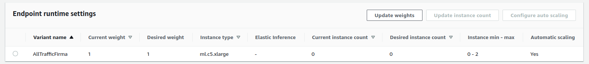

# Sagemaker Async Inference

This repository contains Infrastructure as code (Cloudformation templates) to 
deploy an asyncronous inference endpoint in sagemaker. The Idea is to make a 
performance benchmark for this kind of endpoint.

## Underlying resources and infrastructure

The cloudformation templates deploy the following resources on AWS.

[x] S3 Bucket to upload and save the model artifact 
[x] Lambda to test sagemaker endpoint 
[x] Lambda Execution Role with the necessary permissions 
[x] Sagemaker Execution Role with the necessary permissions 
[x] Sagemaker Model 
[x] Sagemaker Endpoint Config 
[x] S3 Bucket to upload sagemaker endpoint's input and save sagemaker endpoint's results 
[x] Sagemaker Endpoint 
[x] Application Auto Scaling Target 
[x] Application Auto Scaling Policy 

## Results

The results of the experiments and benchmark for this kind of model is the following:

### 0 instances when the endpoint is not used (AutoScaling)

Thanks to the auto scaling configuration, when the endpoint is not in used it will scale in to 0 instances, thus it will not charge money and it will save costs:

