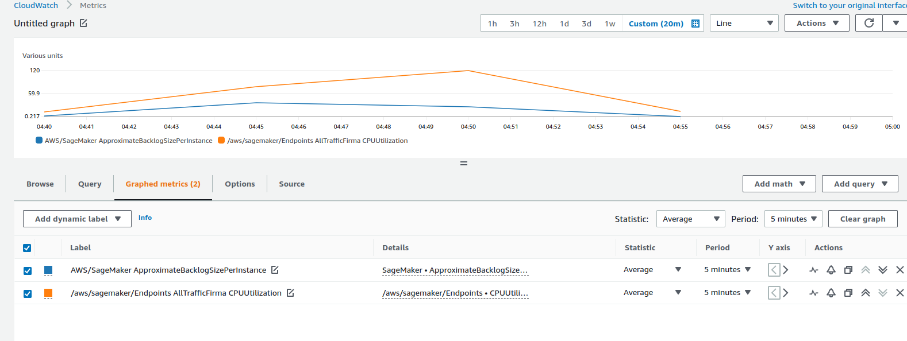

# Sagemaker Async Inference

This repository contains Infrastructure as code (Cloudformation templates) to 
deploy an asyncronous inference endpoint in sagemaker. The Idea is to make a 
performance benchmark for this kind of endpoint.

## Underlying resources and infrastructure

The cloudformation templates deploy the following resources on AWS.

[x] S3 Bucket to upload and save the model artifact 
[x] Lambda to test sagemaker endpoint 
[x] Lambda Execution Role with the necessary permissions 
[x] Sagemaker Execution Role with the necessary permissions 
[x] Sagemaker Model 
[x] Sagemaker Endpoint Config 
[x] S3 Bucket to upload sagemaker endpoint's input and save sagemaker endpoint's results 
[x] Sagemaker Endpoint 
[x] Application Auto Scaling Target 
[x] Application Auto Scaling Policy 

## Results

The results of the experiments and benchmark for this kind of model is the following:

### 0 instances when the endpoint is not used (AutoScaling)

Thanks to the auto scaling configuration, when the endpoint is not in used it will scale in to 0 instances, thus it will not charge money and it will save costs:

### 150 calls to the endpoint

Current autoscaling configuration is up to two instances, with this configuration and having in account the 15 minutes timeout for the lambda function, the results were very good. The system was able to process 150 asynchronous request in 532 seconds (8.86 min), and thanks to the endpoint's internal queue the instances did not hang out.

the cpu utilization of the system with two instances increase up to 119% and each instance process up to 4~7 request at a time.

[results_150_csv](false_sagemaker_clients/results/lambda_execution_05_22_2022_150.csv)

### 250 Calls to the endpoint

In this case, with current autoscaling and endpoint configurations, the results were good until it reached the 220 request call. Since the lambda function have a 15 minutes timeout, after the 220 processed requests, the rest 30 calls to the lambda function resulted in timeout exception. If we want to solve this problem I recommend increase the max instances parameter in the autoscaling configuration. So for 220 or more, I don't recommend the use with a lambda integration, because it will increase cost for the lambda function.

[results_150_csv](false_sagemaker_clients/results/lambda_execution_05_22_2022_250.csv)